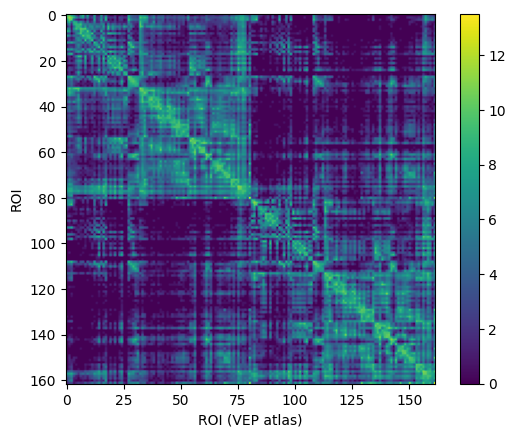
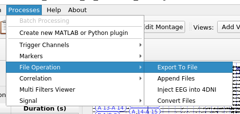
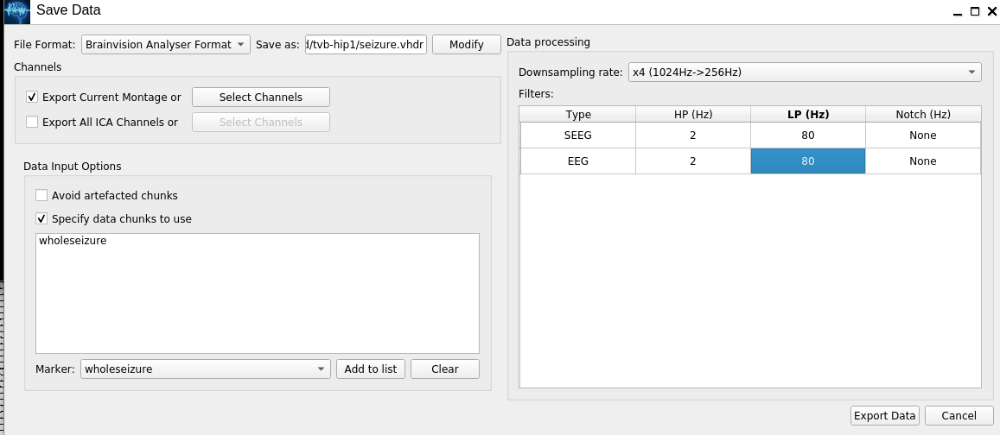
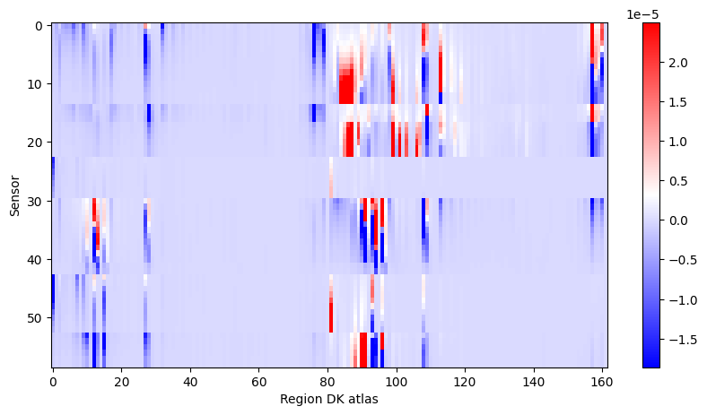
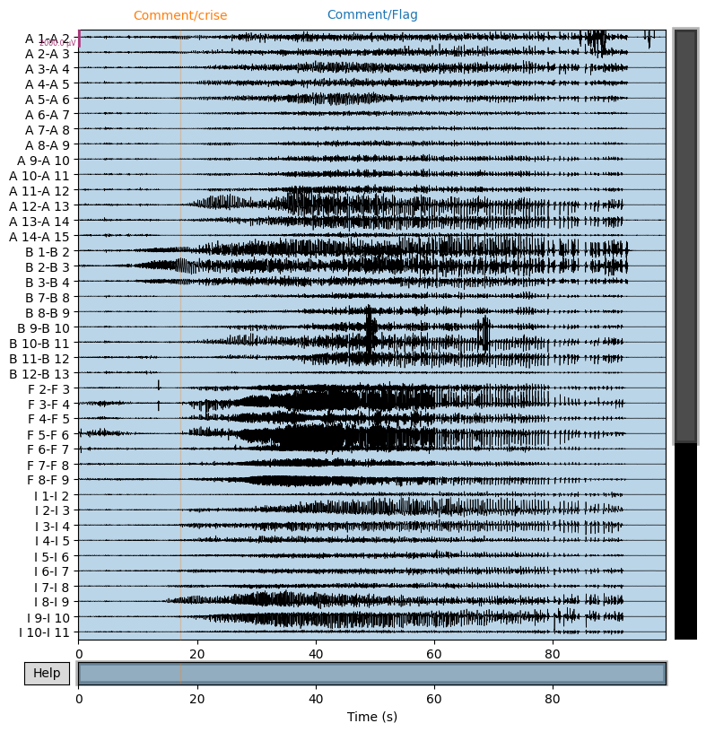
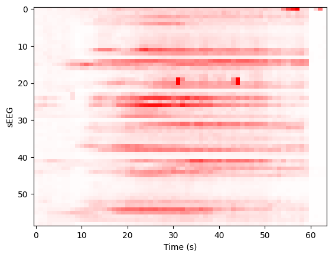
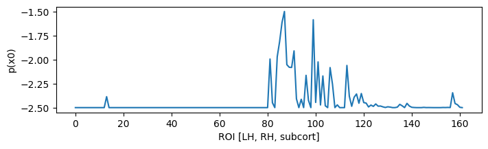
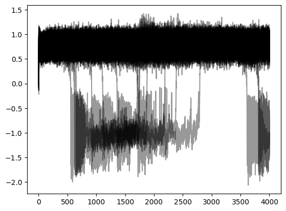
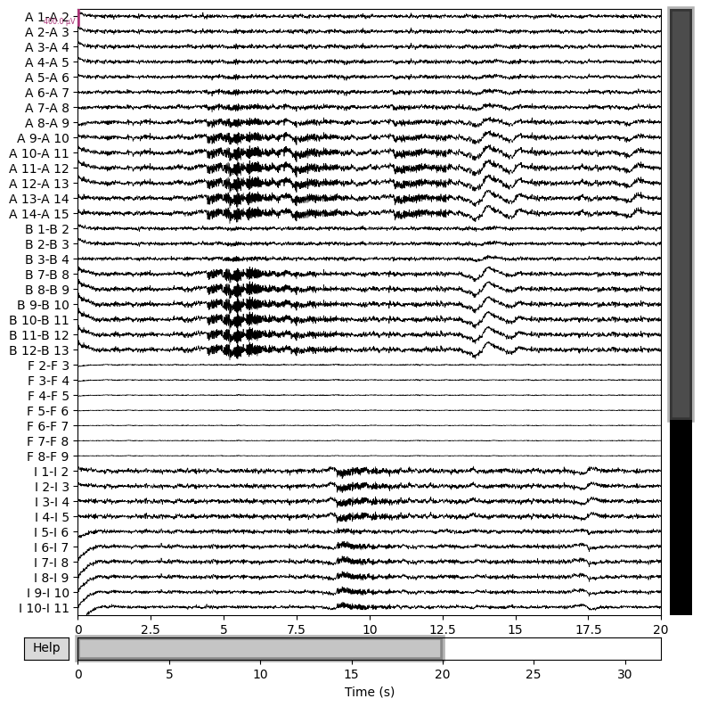

Here we will show a short demonstration of using data from HIP
partners to do simulation, with parameters guessed from one of the
patient’s seizures.

.. code:: python

   %pylab inline
   import re
   import numpy as np
   import mne
   import nibabel
   from tvb.simulator.lab import *

::

   %pylab is deprecated, use %matplotlib inline and import the required libraries.
   Populating the interactive namespace from numpy and matplotlib

   /usr/local/lib/python3.10/dist-packages/tvb/datatypes/surfaces.py:60: UserWarning: Geodesic distance module is unavailable; some functionality for surfaces will be unavailable.
     warnings.warn(msg)

Let’s check our access to some data

First sEEG contacts: use your favorite 3D tool to localize sEEG contacts
in T1 space as in the following example:

.. code:: python

   !head ~/nextcloud/tvb-preprocessed-tutorial-data/fs/hip1/elec/seeg.xyz

::

   L1      -12.20   53.60   67.20
   L2       -8.70   53.65   67.20
   L3       -5.20   53.69   67.20
   L4       -1.70   53.74   67.20
   L5        1.80   53.78   67.20
   L6        5.30   53.83   67.20
   L7        8.80   53.88   67.20
   L8       12.30   53.92   67.20
   L9       15.80   53.97   67.20
   L10      19.30   54.02   67.20

then we load them

.. code:: python

   pl_names = []
   pl_xyz = []
   fsdir = os.path.expanduser('~/nextcloud/tvb-preprocessed-tutorial-data/fs/hip1')
   with open(f'{fsdir}/elec/seeg.xyz', 'r') as fd:
       for line in fd.readlines():
           if line.startswith('plot'):
               continue
           name, *xyz = [_ for _ in line.strip().split(' ') if _.strip()]
           pl_names.append(name)
           pl_xyz.append(np.array([float(_) for _ in xyz]))

Load connectivity & one seizure,

.. code:: python

   conn = connectivity.Connectivity.from_file(f'{fsdir}/tvb/connectivity.vep.zip')
   conn.configure()
   conn.weights[:] = np.log(1 + conn.weights)
   imshow(conn.weights); colorbar(); xlabel('ROI (VEP atlas)'), ylabel('ROI'); show();

::

   2023-09-12 13:37:58,933 - WARNING - tvb.basic.readers - File 'hemispheres' not found in ZIP.

   png

If seizure is not in VHDR, convert first with Anywave:

.. code:: python

   !ls ~/nextcloud/tutorial_data/Data_for_electrodes_labelling/Case1/SEEG

::

   case1EEG_12HIP_RAS.TRC          case1EEG_13HIP_seizure.TRC.mrk
   case1EEG_13HIP_seizure.TRC      case1EEG_13HIP_seizure.TRC.mtg
   case1EEG_13HIP_seizure.TRC.bad      case1EEG_14HIP_seizure.TRC
   case1EEG_13HIP_seizure.TRC.display

We open the TRC w/ Anywave, mark bad channels, isolate the section with
the seizure with a marker for that section, |image.png|

start an export

   image.png

set file name w/ marker name

   image.png

and save to the tvb folder, then load with MNE:

.. code:: python

   !ls ~/nextcloud/tvb-preprocessed-tutorial-data/fs/hip1/seeg/tvb-hip1

::

   seizure-bipolar.eeg   seizure-monopolar.eeg   seizure.eeg
   seizure-bipolar.vhdr  seizure-monopolar.vhdr  seizure.vhdr
   seizure-bipolar.vmrk  seizure-monopolar.vmrk  seizure.vmrk

.. code:: python

   raw = mne.io.read_raw_brainvision(
       f'{fsdir}/seeg/tvb-hip1/seizure-bipolar.vhdr',
       preload=True
   )

::

   Extracting parameters from /home/woodman/nextcloud/tvb-preprocessed-tutorial-data/fs/hip1/seeg/tvb-hip1/seizure-bipolar.vhdr...
   Setting channel info structure...
   Reading 0 ... 25378  =      0.000 ...    99.133 secs...

   /tmp/ipykernel_421/3985157263.py:1: RuntimeWarning: Limited 1 annotation(s) that were expanding outside the data range.
     raw = mne.io.read_raw_brainvision(

Construct gain matrix for bipolar electrodes in recording,

.. code:: python

   re_one = '([A-Z][A-Za-z]*\'?) ([0-9]+)'
   re_bip = re.compile(f'{re_one}-{re_one}')
   ch_bip_idx = []
   bip_gain = []
   electrodes = []
   picks = []
   pick_names = []
   for i_ch, ch in enumerate(raw.ch_names):
       match = re_bip.match(ch)
       if match:
           picks.append(i_ch)
           pick_names.append(ch)
           e, i, _, j = match.groups()
           electrodes.append(e)
           i, j = int(i), int(j)
           e = e.replace('\'', 'p')
           ch_bip_idx.append((e, i, j))
           #pl_names.index(
           #r = np.sqrt(np.sum((cxyz(e,np.c_[i,j].T)[:,None] - conn.centres)**2, axis=2))
           try:
               cxyz = np.c_[pl_xyz[pl_names.index(f'{e}{i}')],
                            pl_xyz[pl_names.index(f'{e}{j}')]].T[:, None]
           except ValueError:
               pass
           r = np.sqrt(np.sum((cxyz - conn.centres)**2, axis=2))    
           g = 1/r**3
           bip_gain.append(g[1] - g[0])
   picks = np.array(picks)
   bip_gain = np.array(bip_gain)
   bip_gain = np.clip(bip_gain, *np.percentile(bip_gain.flat[:], [1,99]))
   figure(figsize=(10, 5))
   imshow(bip_gain, cmap='bwr', aspect='auto', interpolation='none'), colorbar(), xlabel('Region DK atlas'), ylabel('Sensor');

   png

Pick out seizure from recording,

.. code:: python

   snip = raw.copy()
   snip.pick_channels(pick_names)
   snip.load_data()
   snip.filter(1,30)
   snip.resample(64)
   snip.plot(n_channels=40,duration=100,scalings={'eeg':1e-3});

::

   NOTE: pick_channels() is a legacy function. New code should use inst.pick(...).
   Filtering raw data in 1 contiguous segment
   Setting up band-pass filter from 1 - 30 Hz

   FIR filter parameters
   ---------------------
   Designing a one-pass, zero-phase, non-causal bandpass filter:
   - Windowed time-domain design (firwin) method
   - Hamming window with 0.0194 passband ripple and 53 dB stopband attenuation
   - Lower passband edge: 1.00
   - Lower transition bandwidth: 1.00 Hz (-6 dB cutoff frequency: 0.50 Hz)
   - Upper passband edge: 30.00 Hz
   - Upper transition bandwidth: 7.50 Hz (-6 dB cutoff frequency: 33.75 Hz)
   - Filter length: 845 samples (3.301 s)

   Using matplotlib as 2D backend.

   [Parallel(n_jobs=1)]: Done  17 tasks      | elapsed:    0.0s

   png

We construct the envelop of the data, per 1 s windows,

.. code:: python

   y, t = snip[:]
   ysd = y[:,:y.shape[1]//64*64].reshape((len(y), 64, -1)).std(axis=-1)
   scl = 1e-3
   imshow(ysd, aspect='auto', interpolation='none', cmap='bwr', vmin=-scl, vmax=scl)
   xlabel('Time (s)'), ylabel('sEEG'); show();

   png

Projecting to TVB sources, we can determine a prior for the Epileptor x0
parameter based onset times,

.. code:: python

   ssd = np.clip(bip_gain.T.dot(ysd),0,1) * np.r_[1:0:64j]**3
   x0p = ssd.sum(axis=-1)
   x0p /= x0p.max()
   x0p = -2.5 + x0p
   figure(figsize=(8, 2)); plot(x0p); xlabel('ROI [LH, RH, subcort]'); ylabel('p(x0)'); show();

   png

With a few examples for the ranking

.. code:: python

   for i in np.argsort(x0p)[::-1][:5]:
       print(i, x0p[i], conn.region_labels[i])

::

   87 -1.5 Right-Inferior-frontal-sulcus
   99 -1.5861556255555924 Right-Precentral-sulcus-inferior-part
   86 -1.6136127237070008 Right-F3-pars-opercularis
   85 -1.8120990493471199 Right-F3-Pars-triangularis
   91 -1.9098045348007213 Right-SFS-rostral

Now construct a simulation,

.. code:: python

   epileptor = models.Epileptor(Ks=np.r_[-0.2], Kf=np.r_[0.1], r=np.r_[0.00015])
   epileptor.x0 = x0p
   nsig = np.r_[0., 0., 0., 0.0005, 0.0005, 0.]
   addnoise = noise.Additive(nsig=nsig, ntau=5.0)
   initial = np.r_[-1.9, -17., 3.1, -1., 0.04, -0.17]
   initial = np.zeros((100, 1, conn.number_of_regions, 1)) + initial[:, None, None]
   sim = simulator.Simulator(
       connectivity=conn,
       coupling=coupling.Difference(a=np.r_[0.03]),
       model=epileptor,
       integrator=integrators.HeunStochastic(dt=0.05,noise=addnoise),
       initial_conditions=initial,
   )
   sim.configure()

.. raw:: html

   <table>

.. raw:: html

   <thead>

.. raw:: html

   <h3>

Simulator

.. raw:: html

   </h3>

.. raw:: html

   </thead>

.. raw:: html

   <tbody>

.. raw:: html

   <tr>

.. raw:: html

   <td colspan="2">

.. raw:: html

   

.. container:: document
   :name: 73fe0e30-5172-11ee-b38b-0242ac110002

   .. raw:: html

      

   A Simulator assembles components required to perform simulations.

   .. raw:: html

      

.. raw:: html

   

.. raw:: html

   

.. raw:: html

   </td>

.. raw:: html

   </tr>

.. raw:: html

   <tr>

.. raw:: html

   <th>

.. raw:: html

   </th>

.. raw:: html

   <th style="text-align:left;width:80%">

value

.. raw:: html

   </th>

.. raw:: html

   </tr>

.. raw:: html

   <tr>

.. raw:: html

   <td>

Type

.. raw:: html

   </td>

.. raw:: html

   <td style="text-align:left;">

.. raw:: html

   <pre>Simulator</pre>

.. raw:: html

   </td>

.. raw:: html

   </tr>

.. raw:: html

   <tr>

.. raw:: html

   <td>

conduction_speed

.. raw:: html

   </td>

.. raw:: html

   <td style="text-align:left;">

.. raw:: html

   <pre>3.0</pre>

.. raw:: html

   </td>

.. raw:: html

   </tr>

.. raw:: html

   <tr>

.. raw:: html

   <td>

connectivity

.. raw:: html

   </td>

.. raw:: html

   <td style="text-align:left;">

.. raw:: html

   <pre>Connectivity gid: b7b9f755-2761-4bc2-8115-ae8b475c11d2</pre>

.. raw:: html

   </td>

.. raw:: html

   </tr>

.. raw:: html

   <tr>

.. raw:: html

   <td>

coupling

.. raw:: html

   </td>

.. raw:: html

   <td style="text-align:left;">

.. raw:: html

   <pre>Difference gid: ba86c269-6714-4fe3-a7ae-7cce73061bc1</pre>

.. raw:: html

   </td>

.. raw:: html

   </tr>

.. raw:: html

   <tr>

.. raw:: html

   <td>

gid

.. raw:: html

   </td>

.. raw:: html

   <td style="text-align:left;">

.. raw:: html

   <pre>UUID('93b83c19-43a9-4da0-8a05-2d11e0756aa4')</pre>

.. raw:: html

   </td>

.. raw:: html

   </tr>

.. raw:: html

   <tr>

.. raw:: html

   <td>

initial_conditions

.. raw:: html

   </td>

.. raw:: html

   <td style="text-align:left;">

.. raw:: html

   <pre> [min, median, max] = [-17, -0.585, 3.1] dtype = float64 shape = (100, 6, 162, 1)</pre>

.. raw:: html

   </td>

.. raw:: html

   </tr>

.. raw:: html

   <tr>

.. raw:: html

   <td>

integrator

.. raw:: html

   </td>

.. raw:: html

   <td style="text-align:left;">

.. raw:: html

   <pre>HeunStochastic gid: 17b17c7b-69ac-437e-81a1-18932deef33c</pre>

.. raw:: html

   </td>

.. raw:: html

   </tr>

.. raw:: html

   <tr>

.. raw:: html

   <td>

model

.. raw:: html

   </td>

.. raw:: html

   <td style="text-align:left;">

.. raw:: html

   <pre>Epileptor gid: a883a1cb-d9f6-4e64-93e2-42d1347b40ef</pre>

.. raw:: html

   </td>

.. raw:: html

   </tr>

.. raw:: html

   <tr>

.. raw:: html

   <td>

monitors

.. raw:: html

   </td>

.. raw:: html

   <td style="text-align:left;">

.. raw:: html

   <pre>('TemporalAverage',)</pre>

.. raw:: html

   </td>

.. raw:: html

   </tr>

.. raw:: html

   <tr>

.. raw:: html

   <td>

simulation_length

.. raw:: html

   </td>

.. raw:: html

   <td style="text-align:left;">

.. raw:: html

   <pre>1000.0</pre>

.. raw:: html

   </td>

.. raw:: html

   </tr>

.. raw:: html

   <tr>

.. raw:: html

   <td>

stimulus

.. raw:: html

   </td>

.. raw:: html

   <td style="text-align:left;">

.. raw:: html

   <pre>None</pre>

.. raw:: html

   </td>

.. raw:: html

   </tr>

.. raw:: html

   <tr>

.. raw:: html

   <td>

surface

.. raw:: html

   </td>

.. raw:: html

   <td style="text-align:left;">

.. raw:: html

   <pre>None</pre>

.. raw:: html

   </td>

.. raw:: html

   </tr>

.. raw:: html

   <tr>

.. raw:: html

   <td>

title

.. raw:: html

   </td>

.. raw:: html

   <td style="text-align:left;">

.. raw:: html

   <pre>Simulator gid: 93b83c19-43a9-4da0-8a05-2d11e0756aa4</pre>

.. raw:: html

   </td>

.. raw:: html

   </tr>

.. raw:: html

   </tbody>

.. raw:: html

   </table>

Run the simulation

.. code:: python

   (t,y), = sim.run(simulation_length=4000.0)
   y += randn(*y.shape)/10 # observation noise

Butterfly plot of source activity for seizure,

.. code:: python

   plot(t,y[:,0,:,0], 'k', alpha=0.4); show();

   png

Projecting the source activity back to sources and creating an MNE Raw
object from that, for analysis

.. code:: python

   seeg = bip_gain.dot(y[:,0,:,0].T)
   seeg /= seeg.std()
   seeg *= snip[:][0].std()
   info = mne.create_info(pick_names, 1e3/(t[1] - t[0])/8, 'eeg')
   raw_sim = mne.io.RawArray(seeg, info)
   raw_sim.info['sfreq']

::

   Creating RawArray with float64 data, n_channels=59, n_times=4000
       Range : 0 ... 3999 =      0.000 ...    31.992 secs
   Ready.

   125.0

then filter and inspect seizure,

.. code:: python

   raw_sim.filter(1,50,n_jobs=4)
   raw_sim.plot(n_channels=40,duration=20,scalings={'eeg':2e-4});

::

   Filtering raw data in 1 contiguous segment
   Setting up band-pass filter from 1 - 50 Hz

   FIR filter parameters
   ---------------------
   Designing a one-pass, zero-phase, non-causal bandpass filter:
   - Windowed time-domain design (firwin) method
   - Hamming window with 0.0194 passband ripple and 53 dB stopband attenuation
   - Lower passband edge: 1.00
   - Lower transition bandwidth: 1.00 Hz (-6 dB cutoff frequency: 0.50 Hz)
   - Upper passband edge: 50.00 Hz
   - Upper transition bandwidth: 12.50 Hz (-6 dB cutoff frequency: 56.25 Hz)
   - Filter length: 413 samples (3.304 s)

   [Parallel(n_jobs=4)]: Using backend LokyBackend with 4 concurrent workers.
   [Parallel(n_jobs=4)]: Done  14 tasks      | elapsed:    0.8s
   [Parallel(n_jobs=4)]: Done  59 out of  59 | elapsed:    0.8s finished

   png

This shows that we can quickly reproduce a seizure similar the patient’s
with a TVB model, with an seizure onset heuristic. For a more precise
match, the ``x0`` parameter of the model requires some tuning. This can
be done by hand or automatically, via Bayesian inference, which will be
the subject of another workflow example.

.. code:: python

.. |image.png| image:: simulation_files/25918a70-0c87-470c-8c56-371dc53b75a9.png
